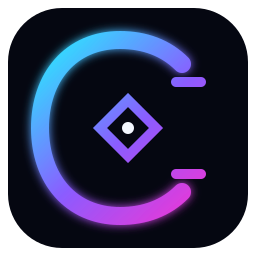

<p align="center">
  
</p>

<h1 align="center">CYBOARD</h1>

<p align="center">
  <strong>Cyberpunk command center for your AI coding agents.</strong>
</p>

<p align="center">
  Monitor quota, reset windows, active sessions, usage trends, and provider health for Codex, Claude Code, Cursor, and future AI coding tools — from one local-first macOS app.
</p>

<p align="center">
  <a href="./README.zh-TW.md">繁體中文</a> · <strong>English</strong>
</p>

> [!IMPORTANT]
> CYBOARD is under active development and does not have a stable release yet. Phase 1 is currently developed on `feat/phase1-core`. Until it is merged into `main`, check out that branch before running the app.

## What is CYBOARD?

If you use several AI coding tools at the same time, it quickly becomes difficult to answer simple questions:

- How much Codex quota do I have left?
- When does Claude Code reset?
- Is Cursor approaching its current-period limit?
- Which coding agents are running right now?
- At my current burn rate, will I exhaust a quota before it resets?

CYBOARD brings those signals into a single macOS menu-bar application and full dashboard.

The product uses a clean cyberpunk / holographic HUD visual language, with a future 3D **CYBOARD Operator** designed to behave like an original AI systems operator rather than a decorative mascot.

## Highlights

- **Multi-provider monitoring** — Codex, Claude Code, and Cursor first; provider adapters make future integrations straightforward.
- **Quota and reset windows** — normalize different provider limit models into a consistent UI.
- **Menu-bar first** — a compact surface for quick checks, with a larger dashboard for deeper inspection.
- **Active agent sessions** — surface running local coding-agent processes and associated projects where reliable.
- **Burn-rate forecasting** — estimate whether current usage is likely to exhaust a quota before the next reset.
- **Native notifications** — configurable low-quota thresholds.
- **Launch at login** — optional macOS startup behavior.
- **Local-first privacy** — credentials are never intentionally persisted in CYBOARD's own storage or exposed to the WebView.
- **Performance budgets** — background polling, rendering, history size, CPU, memory, and future WebGL work are explicitly bounded.
- **Testable provider contracts** — provider parsing and domain logic are designed around fixtures and regression tests.

## Provider status

| Provider | Quota / reset | Active sessions | Usage history | Notes |
| --- | --- | --- | --- | --- |
| Codex | Phase 1 | Phase 1 | In progress | Uses the local Codex app-server where possible |
| Claude Code | Phase 1 | Phase 1 | In progress | Reads local first-party auth state and usage endpoints |
| Cursor | Phase 1 | Phase 1 | In progress | Reads Cursor desktop state read-only |
| Gemini CLI / Antigravity / Copilot / OpenCode | Planned | Planned | Planned | Future provider adapters |

Availability is capability-based: if a provider does not expose a reliable metric, CYBOARD should show it as unavailable rather than pretending the value is zero.

## Tech stack

- **Desktop shell:** Tauri v2
- **Frontend:** Solid.js + TypeScript + Vite
- **Native backend:** Rust
- **Desktop platform:** macOS first
- **Testing:** Vitest + Solid Testing Library + Rust tests
- **Package manager:** Bun

The frontend owns presentation and normalized domain behavior. Native access to processes, local provider state, Keychain-backed credentials, SQLite, and provider network calls stays behind the Rust/Tauri boundary.

## Getting started

### 1. Requirements

You need:

- macOS
- Git
- [Bun](https://bun.sh/)
- Rust toolchain (`rustc` + `cargo`)
- Xcode Command Line Tools
- At least one supported provider installed and signed in if you want real provider data

Check your environment:

```bash
bun --version
rustc --version
cargo --version
xcode-select -p
```

If Xcode Command Line Tools are missing:

```bash
xcode-select --install
```

If Rust is missing, install the official Rust toolchain with `rustup`:

```bash
curl --proto '=https' --tlsv1.2 -sSf https://sh.rustup.rs | sh
source "$HOME/.cargo/env"
```

Then verify:

```bash
rustc --version
cargo --version
```

### 2. Clone the repository

```bash
git clone https://github.com/Fallins/cyboard-punk.git
cd cyboard-punk
```

While Phase 1 is still awaiting merge:

```bash
git checkout feat/phase1-core
```

### 3. Install dependencies

```bash
bun install
```

### 4. Run the real desktop app

```bash
bun run tauri dev
```

This is the normal development command. Tauri starts the Vite frontend automatically and launches the native macOS application.

The first Rust build can take noticeably longer because Cargo needs to download and compile the Tauri/Rust dependency graph. Later launches are much faster because those artifacts are cached.

### Web-only UI development

You can also run:

```bash
bun run dev
```

This starts only the Vite/Solid frontend. It is useful for visual work, but **native CYBOARD features will not function correctly** because the Tauri/Rust backend is not running. That includes provider access, local process detection, Keychain/SQLite access, native notifications, and menu-bar behavior.

In short:

```text
bun run dev        -> frontend UI only
bun run tauri dev  -> complete CYBOARD desktop application
```

## Development commands

```bash
# TypeScript type checking
bun run typecheck

# Frontend/domain tests with coverage
bun run test

# Watch tests
bun run test:watch

# Production frontend build
bun run build

# Typecheck + tests + frontend build
bun run check

# Start Tauri development app
bun run tauri dev
```

Rust checks:

```bash
cd src-tauri

cargo fmt --check
cargo clippy -- -D warnings
cargo test
```

GitHub CI is intentionally not required for this project. Merge validation is local-first on macOS; see [`docs/testing.md`](./docs/testing.md).

## Project structure

```text
cyboard-punk/
├── src/
│   ├── domain/           # normalized quota/usage/session models and forecasting
│   ├── notifications/    # alert rules and native notification bridge
│   ├── providers/        # frontend provider client contract
│   ├── settings/         # persisted user preferences
│   └── ui/               # compact menu surface and full dashboard
├── src-tauri/
│   └── src/
│       ├── providers.rs  # native provider collection
│       ├── parsers.rs    # provider payload normalization
│       ├── sessions.rs   # local agent/process discovery
│       └── models.rs     # Rust-side normalized models
├── public/brand/         # CYBOARD visual assets
└── docs/                 # architecture, roadmap, testing, performance and brand specs
```

For deeper implementation details, see [`docs/architecture.md`](./docs/architecture.md).

## Design direction

CYBOARD uses a clean sci-fi cyberpunk language rather than a noisy neon-city aesthetic:

- near-black / deep navy surfaces
- cyan system accents
- violet and magenta energy accents
- restrained glow and glass/HUD layers
- semantic warning and danger states
- reduced-motion support

Phase 2 introduces a lazy-loaded 3D **CYBOARD Operator** with idle, observing, processing, warning, success, and offline states. The renderer must suspend while hidden and provide a static fallback for reduced-motion, low-power, or WebGL failure scenarios.

See [`docs/brand.md`](./docs/brand.md) and [`docs/operator-character.md`](./docs/operator-character.md).

## Privacy and security

CYBOARD is designed as a **local-first** desktop application.

Core rules include:

- provider credentials must not be written into CYBOARD's own persistent storage;
- secrets must not be passed to the frontend WebView;
- secrets must not appear in application logs or test fixtures;
- Cursor state is read-only for monitoring purposes;
- provider failures should degrade to explicit unavailable/stale states rather than fabricated data;
- real account IDs, tokens, cookies, and unredacted payloads must never be committed as fixtures.

Read [`PRIVACY.md`](./PRIVACY.md) and [`SECURITY.md`](./SECURITY.md) before changing provider authentication or local-data access code.

## Performance philosophy

A menu-bar monitoring application should not become the thing consuming your machine while your coding agents work.

CYBOARD therefore defines explicit limits for:

- idle/background CPU usage
- memory usage
- provider polling frequency
- history retention
- expensive filesystem scanning
- hidden-window rendering
- future WebGL frame rate, texture size, triangle count, and asset weight

See [`docs/performance.md`](./docs/performance.md).

## Roadmap

### Phase 1 — Monitoring core

Desktop shell, compact menu surface, Codex/Claude Code/Cursor adapters, normalized quota and session state, forecasting, notifications, settings, tests, and performance hardening.

### Phase 2 — CYBOARD Operator

Lazy-loaded Three.js/WebGL operator renderer, original 3D holographic AI operator, animation state machine, provider-linked HUD panels, static fallback, and GPU/CPU instrumentation.

### Phase 3 — Assistant layer

Optional voice feedback, natural-language status questions, task-completion summaries, and configurable notification personalities.

See the detailed [`docs/roadmap.md`](./docs/roadmap.md).

## Contributing

CYBOARD is still early. If you want to contribute:

1. Read [`AGENTS.md`](./AGENTS.md), especially when using coding agents.
2. Keep provider-specific behavior behind provider boundaries.
3. Add regression fixtures/tests for upstream provider schema changes.
4. Do not commit credentials or real private provider payloads.
5. Run the relevant local checks before opening or updating a pull request.
6. Keep performance and privacy budgets intact when adding visual or monitoring features.

Bug reports and provider compatibility findings are especially useful because these upstream interfaces can change independently of CYBOARD.

## Project status

CYBOARD is currently a development preview. APIs, data models, and UI structure may change before the first stable release.

The goal is simple: **one fast, private, visually distinctive control center for all of your AI coding agents.**
